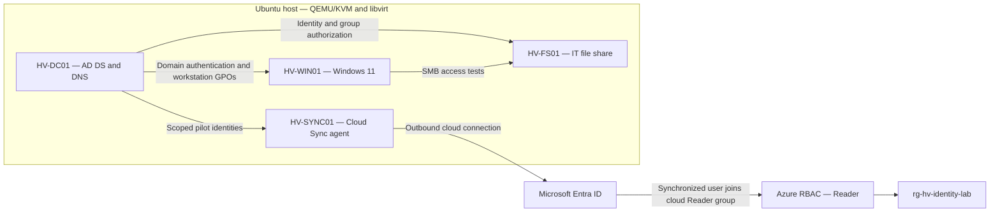

# Houston Vanguards — Hybrid Identity Security Engineering Lab

An implemented Active Directory–Microsoft Entra ID lab demonstrating identity architecture, access control, privileged credential protection, troubleshooting, and automation.

The project models the security needs of a fictional professional baseball organization. Its business scenario describes approximately **1,500 workforce identities**; the deployed lab uses a small representative pilot, not 1,500 provisioned accounts. The latest recorded AD inventory contains **8 users, 64 groups, and 4 computer objects**, including built-in directory objects.

**Current status — October 5, 2026:** Phases 0–4 are complete based on recorded lab validation. Phase 5, identity automation, is in progress. Infrastructure runs locally on Ubuntu/KVM; Microsoft Entra ID and an Azure resource group provide the cloud side. This is a learning and engineering portfolio, not a production deployment or a compliance certification.

## Start here

| Review interest | Evidence and implementation |
|---|---|
| Architecture and engineering decisions | [Current environment](documentation/architecture-notes.md) · [Decision log](documentation/decision-log.md) |
| Identity and access engineering | [AD identity model](identity/ad-identity-model.md) · [Hybrid identity design](architecture/entra-hybrid-identity-design.md) |
| Security controls and testing | [Phase 3: GPO, AGDLP, and LAPS](documentation/phase-3-implementation-evidence.md) · [Phase 4: synchronization and Azure RBAC](documentation/phase-4-hybrid-identity-evidence.md) |
| Code and reproducibility | [Automation guide](documentation/automation-guide.md) · [Phase 5 progress](documentation/phase-5-automation-evidence.md) |
| Troubleshooting and measured results | [Incident investigations](troubleshooting/troubleshooting.md) · [Evidence index](documentation/evidence-index.md) · [Recorded metrics](metrics/README.md) |

## What has been built and tested

- **Active Directory foundation:** Windows Server 2025 AD DS and DNS, a protected OU hierarchy, separate standard and privileged identities, and departmental/resource security groups.
- **Workstation security:** purpose-specific GPOs for the security baseline, auditing, and Windows LAPS. Effective policy was checked with `gpresult`, direct settings checks, and Security Event 4688.
- **Resource authorization:** an SMB share on a dedicated member server with AGDLP group nesting. Read/write access passed; a read-only user could read but could not create, modify, or delete files.
- **Local administrator recovery:** Windows LAPS with encrypted AD backup. Authorized recovery succeeded and a standard-user retrieval attempt returned no password data. Rotation and post-authentication actions are configured; a complete timed rotation/recovery exercise is not claimed.
- **Hybrid identity:** a dedicated Cloud Sync server, a gMSA service identity, and a pilot group containing one standard user. User/group synchronization and cloud sign-in with the AD password and MFA were validated.
- **Azure authorization:** the synchronized user received Reader through a cloud security group at resource-group scope. Reading succeeded; a tag update failed with `AuthorizationFailed`.
- **Automation foundation:** PowerShell AD inventory, Python/Azure CLI Entra reporting, and a Terraform data-source plan against existing Azure resources. Terraform has not been used to deploy the environment.

## Architecture

| System | Platform | Role | Lab address |
|---|---|---|---|
| `HV-DC01` | Windows Server 2025 | AD DS and DNS | `10.50.10.10` |
| `HV-WIN01` | Windows 11 Enterprise Evaluation | Workstation policy and access testing | DHCP |
| `HV-FS01` | Windows Server 2025 Server Core | Domain-member SMB file server | `10.50.10.20` |
| `HV-SYNC01` | Windows Server 2025 Desktop Experience | Dedicated Entra Cloud Sync agent | `10.50.10.30` |

The domain is `corp.hv-lab.test` (`HVL`), using the libvirt NAT network `hv-lab-net`, subnet `10.50.10.0/24`, and gateway `10.50.10.1`. The non-public AD suffix remains local; the pilot cloud account uses the tenant's `onmicrosoft.com` suffix. Cloud Sync scope excludes privileged accounts. Azure resource permissions and Entra directory roles are separate authorization systems.

## Access-control examples

| Scenario | Authorization path | Observed result |
|---|---|---|
| IT read/write | `jrodriguez` → `GG-Dept-IT` → `DL-FS-IT-Shared-RW` → SMB/NTFS | Read, create, modify, and delete succeeded |
| IT read-only | `mchen` → `GG-Role-IT-Shared-Readers` → `DL-FS-IT-Shared-RO` → SMB/NTFS | Read succeeded; create, modify, and delete denied |
| Local password recovery | Authorized LAPS reader/decryptor group → encrypted workstation password | Authorized decryption succeeded; standard-user retrieval returned no data |
| Cloud resource reader | Synced `jrodriguez` → cloud-managed `HV-Cloud-Identity-Readers` → Reader on `rg-hv-identity-lab` | Read succeeded; tag update denied |

The sync pilot group selects identities for synchronization. The cloud Reader group grants Azure access. They serve different purposes and are not interchangeable.

## Project progress

| Phase | Status | Delivered |
|---|---|---|
| 0 — Host and repository | Complete | Ubuntu/KVM readiness, Git workflow, charter, baseline |
| 1 — AD foundation | Complete | Domain controller, DNS, domain health and virtual hardware validation |
| 2 — Identity and workstation | Complete | OU model, identity/group scripts, privileged-account policy, domain-joined client |
| 3 — Security and resource authorization | Complete | Workstation GPOs, audit evidence, SMB access tests, Windows LAPS |
| 4 — Hybrid identity | Complete | Dedicated sync agent, pilot users/groups, cloud authentication, Reader boundary test |
| 5 — Identity automation | In progress | AD inventory, initial Entra reporting, Terraform read-only inventory |

Remaining Phase 5 work includes inventory hardening and verification, controlled lifecycle automation, dry-run testing, execution measurements, and final evidence. PIM, broader PAM/API integrations, Key Vault, application identities, managed identities, and Terraform-managed deployment remain future work. See [project status](documentation/project-status.md) and the [original charter](documentation/project-charter.md).

## Working with the code

Start with the [automation guide](documentation/automation-guide.md), which identifies execution hosts, prerequisites, side effects, and known limitations. AD scripts require Windows and the Active Directory module. The Python reporter uses an authenticated Azure CLI session. Terraform currently reads data sources only.

The `New-HV*.ps1` scripts modify the lab directory and include `-WhatIf` support. They are lab-specific provisioning scripts, not a complete production lifecycle platform. Review the target domain, OU paths, privileges, and sample expiration dates before reuse.

Keep raw directory inventories, credentials, LAPS passwords, MFA enrollment material, offline-domain-join blobs, Terraform state, and local plans outside Git. Public evidence uses aggregate counts and documented results. Committed evidence is a written lab record; raw screenshots and exports are not presented as attached artifacts when they are absent.

## Engineering constraints

- A single domain controller, file server, and sync agent do not provide high availability. A verified pre-schema-change backup was created; a complete restore drill is not documented.
- Tiered administration is a design and operating policy with partial implementation. Full technical tier isolation, privileged workstations, and just-in-time elevation are not claimed.
- The Azure budget alert is **$25/month**, with a preferred operating cost of $0. Alerts are notifications, not a spending cap; current charges and trial expiration must be reviewed separately.
- Windows evaluation media and cloud licensing/offer limits require ongoing review. The repository contains no operating-system images or bundled licenses.
- Metrics reflect recorded lab observations. No invented time savings, production scale, uptime, or business ROI are claimed.

## Repository map

| Directory | Contents |
|---|---|
| `architecture/` | GPO and hybrid designs, virtual hardware, libvirt network |
| `documentation/` | Builds, decisions, status, learning journal, evidence, run instructions |
| `identity/` | OU hierarchy, identity naming, group and administrative-tier design |
| `powershell/` | AD provisioning and inventory scripts |
| `python/` | Entra inventory through Azure CLI |
| `terraform/azure-foundation/` | Existing Azure resource discovery and provider lock file |
| `troubleshooting/` | Evidence-based incident investigations |
| `metrics/` | Recorded counts and measurement boundaries |
| `pam/` | Implemented privileged-access controls and remaining work |

Implementation follows concept review, guided execution, validation, troubleshooting, and documentation. AI assistance supports learning and review; independent reproduction and operational hardening remain explicit learning goals.
